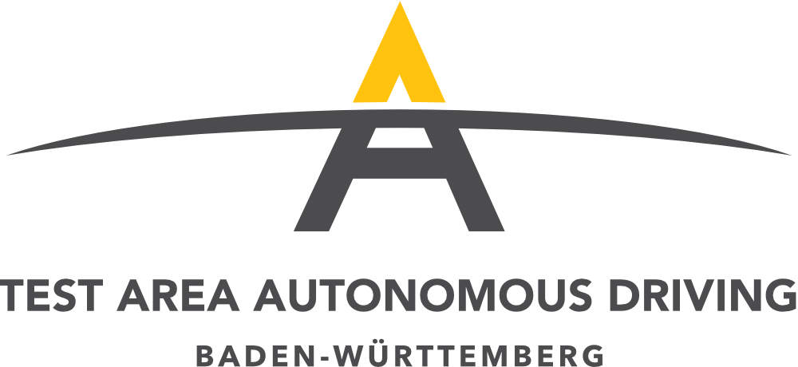
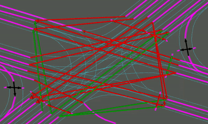
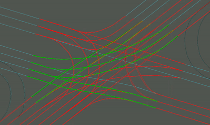

# Introduction

The **Test Area Autonomous Driving Baden-Württemberg Dataset** is recorded with intelligent and connected infrastructure in the [Test Area Autonomous Driving Baden-Württemberg](https://taf-bw.de/en/). This dataset contains examplary data available within the Test Area Autonomous Driving Baden-Württemberg and will be continously extended. More situation aspects of relevant traffic scenarios for the validation and verification of autonomous driving as well as machine learning applications in the field of highly automated vehicles will be added over time. The recorded dataset consists of

* Trajectories of traffic participants
* Traffic light signals and timing in signalized intersections
* Georeferenced maps

covering different urban scenarios in the test area.  

# Dataset Specification

The dataset is provided as .csv-files (*comma separated values*). In order to provide compatibility with existing public motion and interaction datasets, such as the recently published [INTERACTION dataset](https://interaction-dataset.com/), the recorded tracks of the traffic participants are formatted in the following way:

| track_id | frame_id  |  timestamp_ms [ms]  | agent_type | x [m] | y [m] | vx [m/s] | vy [m/s] | psi_rad [rad] | length [m] | width [m]
| -- | -- | -- | -- | -- | -- | -- | -- | -- | --| -- |
| 1045 | 5015 | 4980 | Car | -288.157 | 60.643 | 9.58 | -2.92 | -0.3 | 5 | 1.8
|... | ... | ... | ... | ... |... | ... | ... | ... | ... | ...

Please note that in contrast to other public data sets, the Test Area Autonomous Driving Baden-Württemberg Dataset is precisely referenced in space and time. Thus, when analysing the provided scenarios, additional information sources like weather information can be combined to extract correlation effects on a global, holistic level.

## Metadata

| Dataset-Identifier | Location | Recording length [min:sec] | Time between Measures [ms] |  Spatial Reference (longitude, latitude) | Temporal Reference (yyyy-mm-dd:hh:mm:ss.msms) | SPaT/MAP available | r / v | online / offline |Additional annotation (comments, ...)
| -------- | ----- | ------------- |------------- |------------- |------------- | -------------  | ------------- | ------------- | ---- |
k733_2018-05-02 | Karlsruhe K733 Intersection | 4:03 | 100 | 49.005306/ 8.4374089 | 2018-05-02 12:55:16.3700| - | r | online |GMT+2 |
k733_2020-09-15 | Karlsruhe K733 Intersection | 2:37 | 100 | 49.005306/ 8.4374089 | 2020-09-15 18:06:14.5000| + | r | offline | GMT+2 |

## Reconstructing the spatial reference

The geodetic coordinates with respect to latitude and longitude in degree can be derived from the metric coordinates using a scaled spherical mercator projection with the given parameters (see [here](https://proj.org/operations/projections/merc.html) for more information). The coordinates were either projected by the WGS84 rule or by a spherical projection with a given radius.

A map in the [Lanelet2](https://github.com/fzi-forschungszentrum-informatik/Lanelet2) format is attached to each scenario.

## Reconstructing the temporal reference

Each object in every frame is assgined to a unique timestamp. The relative timestamps of each dataset are based on a temporal reference, which references the absolute time of the respective initial measurement at t=0. 

## SPaT and MAP Data

The Signal Phase and Timing (SPaT) information of the traffic signales are linked to the lanes by the kml file. Each lane (source), which leads into the intersection, indicates into which further lane (sink) it leads and by which signal group it is controlled.
This can be seen in the following graphics.

Arrows show the direction of the connection between two lanes. This can also be pedestrian crossings. The color refere to the current state of the traffic signal.

  
The Connections are now mapped onto the lanelet map.
## Visualizing the datasets

Since the datasets are formatted as .csv-files (*comma separated values*), they can be visualized via web-browser or any spreadsheet application, such as Microsoft Excel or Matlab. However, we recommend the visualization with the tooling, provided with the [INTERACTION](https://interaction-dataset.com/) dataset, see the following Figure.

# Currently known Issues

* A default size of the vehicles is assumed.
* Estimated trajectories leave road borders at south west curve.
* Objects at borders of sensor view have lower quality

# Terms and Conditions
 The Test Area Autonomous Driving Baden-Württemberg Dataset by <a xmlns:cc="http://creativecommons.org/ns#" href="https://github.com/fzi-forschungszentrum-informatik" property="cc:attributionName" rel="cc:attributionURL">FZI Research Center for Information Technology</a> is licensed under a <a rel="license" href="http://creativecommons.org/licenses/by-nc-sa/4.0/">Creative Commons Attribution-NonCommercial-ShareAlike 4.0 International License</a>.

Therefore, the Dataset is only allowed to be used for non-commercial purposes, such as teaching and research. The Licensor thus grants to the End User the right to use the dataset, for its own internal and non-commercial use and for the purpose of scientific research only. 

There may be inaccuracies although the Licensor tried, and will try its best to rectify any inaccuracy once found. We invite all users to report remarks using the repository issue tracker.

If the dataset is used in media, a link to the Licensor’s website is to be included. In case the End User uses the dataset within research papers, the following publications, see [online resource](https://www.researchgate.net/publication/327449884_Towards_Large_Scale_Urban_Traffic_Reference_Data_Smart_Infrastructure_in_the_Test_Area_Autonomous_Driving_Baden-Wurttemberg),
 should be quoted:

> @inproceedings{Fleck:2018,
> author    = {Tobias Fleck and Karam Daaboul and Michael Weber and Philip Sch{\"{o}}rner and Marek Wehmer and Jens Doll and Stefan Orf and Nico Su{\ss}mann and
>               Christian Hubschneider and Marc Ren{\'{e}} Zofka and Florian Kuhnt and Ralf Kohlhaas and  Ingmar Baumgart and Raoul Z{\"{o}}llner and J. Marius Z{\"{o}}llner},
>  title     = {Towards Large Scale Urban Traffic Reference Data: Smart Infrastructure in the Test Area Autonomous Driving Baden-W{\"{u}}rttemberg},
>  booktitle = {Intelligent Autonomous Systems 15 - Proceedings of the 15th International Conference IAS-15, Baden-Baden, Germany, June 11-15, 2018},
>  pages     = {964--982},
> year      = {2018}
>}

Commercially applicable and large datasets as well as large high definition maps for large road tracks in the Test Area can be purchased from the operator of the Test Area Autonomous Driving, which is the Karlsruhe Transport Authority (KVV). Please contact KVV via info(at)kvv.karlsruhe.de or the [online TAF contact formular]( https://taf-bw.de/en/services-prices/) for further information.

# Credits

The Test Area is designed and developed by a consortium of FZI Research Center for Information Technology, the City of Karlsruhe, the Karlsruhe Institute of Technology (KIT), Karlsruhe University of Applied Sciences, the Fraunhofer Institute of Optronics, System Technologies and Image Exploitation IOSB, the Heilbronn University and the City of Bruchsal as well as further associated partners. The Karlsruhe Transport Authority (KVV) will operate the test area.

The Ministry of Transport (VM) of Baden-Württemberg is the sponsor of the Test Field Autonomous Driving. The leading state authority provided 2.5 million euros for conception, planning and construction. The consortium itself as well as associated partners and industrial partners additionally contribute own funds to the project.

# References
* Zhan, Wei and Sun, Liting and Wang, Di and Shi, Haojie and Clausse, Aubrey and Naumann, Maximilian and Kümmerle, Julius and Königshof, Hendrik and Stiller, Christoph and de La Fortelle, Arnaud and Tomizuka, Masayoshi. INTERACTION Dataset: An INTERnational, Adversarial and Cooperative moTION Dataset in Interactive Driving Scenarios with Semantic Maps. arXiv:1910.03088, 2019, [Website](https://interaction-dataset.com/)
* Poggenhans, Fabian and Pauls, Jan-Hendrik and Janosovits, Johannes and Orf, Stefan and Naumann, Maximilian and Kuhnt, Florian and Mayr, Matthias. Lanelet2: A High-Definition Map Framework for the Future of Automated Driving. Proceedings of the IEEE Intelligent  Transportation Systems Conference, 2018, [Website](https://github.com/fzi-forschungszentrum-informatik/Lanelet2)
